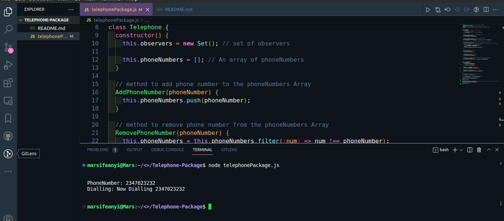

# Telephone Package using the Observer Pattern

## Description

This is the Implementation of JavaScript Design Patterns, using the Observer pattern to create a telephone package

This Project was done to test and demonstrate understanding of the Observer Pattern in JavaScript and its application in Real life.

## Usage

- clone the repository and cd into the directory such that you are on `Telephone-Package`
- To run this code, make sure you have [nodejs](https://nodejs.org) installed
- use the following command to run the code on your terminal

```bash
# run telephonePackage.js

node telephonePackage.js

```

## Sample output

- If the `telephonePackage.js` is run as it is on this repository, the Output should look like as shown below.



## Contributing

This Project is Open for Contribution by all,
Pull requests are welcome.
For major changes, please open an issue first
to discuss what you would like to change.

### Instructions

- Fork this repository
- Clone your forked repository
- Add your scripts
- Commit and push
- Create a pull request
- Wait for pull request to merge

## Show your support

Give a ⭐️ if this project helped you!

## License

[MIT](https://choosealicense.com/licenses/mit/)
